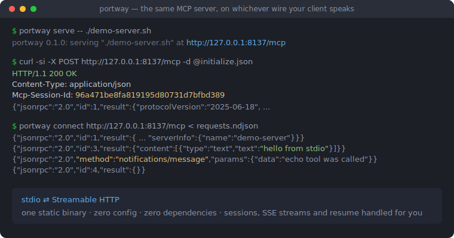
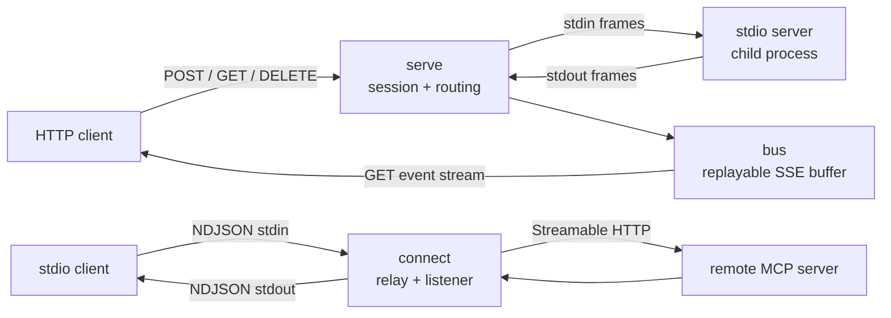

# portway

[English](README.md) | [中文](README.zh.md) | [日本語](README.ja.md)

[](LICENSE) [](go.mod) [](CHANGELOG.md)  [](CONTRIBUTING.md)

**portway：stdio の MCP サーバーを Streamable HTTP で公開する（逆方向も可能な）オープンソースのシングルバイナリブリッジ。純粋なトランスポートアダプタ：同じ JSON-RPC メッセージを別のワイヤーに載せるだけ。ゲートウェイではなく、ポリシーも認証も持たない。**



```bash
git clone https://github.com/JaydenCJ/portway.git && cd portway && go install ./cmd/portway
```

> プレリリース：v0.1.0 はまだ module proxy tag に公開されていないため、上記の手順でソースからインストールしてください。静的な Go バイナリ 1 つ、ランタイム依存ゼロ、デフォルトで 127.0.0.1 にバインド、テレメトリなし。

## なぜ portway？

MCP には 2 つの標準トランスポートがあり、統合のたびに相手が話せない方が必要になります。サーバーは stdio プロセスなのに、クライアントは POST しかできない Web アプリ。クライアントは stdio コマンドの起動しか知らないのに、必要なサーバーは HTTP URL の向こう側。既存のブリッジはランタイム（Python、Node）と依存ツリーを持ち込むか、一方向しかカバーしないか、認証層や設定ファイルを備えたゲートウェイへ肥大化していく——欲しいのは同じバイトを別のワイヤーに流すことだけなのに。portway は意図的に小さく作られています：静的バイナリ 1 つ、サブコマンド 2 つ、双方向、設定ゼロ。即席ブリッジが飛ばしがちな Streamable HTTP 仕様の細部——`Mcp-Session-Id` のライフサイクル、`202` のセマンティクス、独立した GET イベントストリーム、リプレイバッファ付き `Last-Event-ID` 再開、JSON と SSE 両方のレスポンスボディ、プロトコルバージョンヘッダー——を実装しつつ、トランスポートアダプタ以上の何かになることを拒みます。メッセージを書き換えず、認証を足さず、ポリシー判断をしない。必要なら前段に本物のプロキシを置いてください。

| | portway | mcp-proxy (Python) | supergateway (Node) | SDK で自前実装 |
| --- | --- | --- | --- | --- |
| ランタイムの重さ | 静的 Go バイナリ 1 つ | Python + pip 依存 | Node.js + npm 依存 | ビルド次第 |
| 方向 | stdio→HTTP **かつ** HTTP→stdio | 双方向（モード別） | stdio→SSE/WS 中心 | 一方向を手作り |
| セッション管理（`Mcp-Session-Id`、DELETE） | 完全、仕様どおりのステータスコード | 部分的 | 部分的 | 自分で実装 |
| ストリーム再開（`Last-Event-ID` + リプレイバッファ） | あり、重複安全 | なし | なし | 自分で実装 |
| stdio 側での失敗の誠実さ | HTTP エラーを JSON-RPC エラー応答に変換 | クライアントが固まるか stderr のみ | クライアントが固まるか stderr のみ | 自分で実装 |
| スコープ | 設計上トランスポートのみ | トランスポート | トランスポート + ホスティング | 該当なし |

<sub>比較は 2026-07 時点の各上流ドキュメントに基づく。ゲートウェイ（認証、RBAC、レート制限、監査）は別の補完的な問題を解くもの——portway はワイヤーだけを担い、今後もそうあり続けます。</sub>

## 特徴

- **双方向を 1 バイナリで** — `portway serve` は任意の stdio MCP サーバーを HTTP エンドポイントに載せ、`portway connect` は任意の Streamable HTTP エンドポイントを、コマンド起動しかできないクライアント向けの普通の stdio サーバーとして見せます。
- **セッション契約を完全実装** — `Mcp-Session-Id` は initialize で発行し以後を検証、失効セッションには `404`、`DELETE` で解体、再 initialize では子プロセスを再起動するので、再起動したクライアントが締め出されることはありません。
- **サーバー発メッセージも橋を渡る** — 通知とサーバー→クライアント要求は再開可能な GET イベントストリームで届き、SSE id は単調増加、`Last-Event-ID` リプレイバッファは有界。再接続が競合しても構造上、重複配信は起きません。
- **デッドロックも永久待ちもなし** — リクエストは並行に中継され（遅いツール呼び出しが sampling の往復を塞がない）、リクエストの HTTP レベルの失敗はすべて JSON-RPC エラー応答に合成され、stdio クライアントを待たせ続けません。
- **フレーミングを正しく** — CRLF 許容と 32 MiB 上限付きの NDJSON、仕様文法どおりの SSE リーダー/ライター、改行区切りワイヤーへ渡る際の JSON 平坦化、数値 id と文字列 id の厳密な区別、プロトコル 2025-06-18 に従ったバッチ拒否。
- **依存ゼロ、テレメトリゼロ** — 純粋な Go 標準ライブラリのみ。portway は指定されたプロセスまたは URL としか通信せず、デフォルトで 127.0.0.1 にバインドし、92 のオフラインテストとエンドツーエンドのスモークスクリプトで検証済み。

## クイックスタート

付属のデモ stdio サーバーを HTTP で公開します：

```bash
cd examples
portway serve -- ./demo-server.sh
```

```text
portway 0.1.0: serving "./demo-server.sh" at http://127.0.0.1:8137/mcp
```

HTTP を話せるものなら何でも対話できます——以下は実際に取得した出力です：

```bash
curl -si -X POST http://127.0.0.1:8137/mcp \
  -H 'Content-Type: application/json' \
  -H 'Accept: application/json, text/event-stream' \
  -d '{"jsonrpc":"2.0","id":1,"method":"initialize","params":{"protocolVersion":"2025-06-18","capabilities":{},"clientInfo":{"name":"curl","version":"0"}}}'
```

```text
HTTP/1.1 200 OK
Content-Type: application/json
Mcp-Session-Id: 96a471be8fa819195d80731d7bfbd389

{"jsonrpc":"2.0","id":1,"result":{"protocolVersion":"2025-06-18","capabilities":{"tools":{},"logging":{}},"serverInfo":{"name":"demo-server","version":"0.3.0"}}}
```

逆方向はそのまま stdio へ橋渡しできます——応答の間に GET イベントストリーム経由のサーバー発通知が届いている点に注目（中継は並行なので、交錯の順序は実行ごとに変わります）：

```bash
portway connect http://127.0.0.1:8137/mcp < requests.ndjson
```

```text
{"jsonrpc":"2.0","id":1,"result":{"protocolVersion":"2025-06-18","capabilities":{"tools":{},"logging":{}},"serverInfo":{"name":"demo-server","version":"0.3.0"}}}
{"jsonrpc":"2.0","id":2,"result":{"tools":[{"name":"echo","description":"Echo text back","inputSchema":{"type":"object","properties":{"text":{"type":"string"}}}}]}}
{"jsonrpc":"2.0","method":"notifications/message","params":{"level":"info","data":"echo tool was called"}}
{"jsonrpc":"2.0","id":3,"result":{"content":[{"type":"text","text":"hello from stdio"}]}}
{"jsonrpc":"2.0","id":4,"result":{}}
```

stdio しか話せないクライアントにリモート HTTP サーバーを使わせるには、設定を `portway connect` に向けるだけです：

```json
{
  "mcpServers": {
    "remote-tools": {
      "command": "portway",
      "args": ["connect", "--header", "Authorization: Bearer YOUR_TOKEN", "https://mcp.example.test/mcp"]
    }
  }
}
```

## コマンドとフラグ

| フラグ | デフォルト | 効果 |
| --- | --- | --- |
| `serve --listen addr` | `127.0.0.1:8137` | バインドアドレス。`:0` でランダムポート（stderr に表示） |
| `serve --path path` | `/mcp` | 唯一の MCP エンドポイントパス |
| `serve --buffer n` | `256` | `Last-Event-ID` リプレイ用に保持するサーバー発メッセージ数 |
| `connect --header 'K: V'` | なし | 追加 HTTP ヘッダー、複数指定可（例：`Authorization`） |
| `connect --no-listen` | オフ | サーバー発メッセージ用 GET ストリームを開かない |
| `--verbose` | オフ | 主要イベントごとに stderr へ 1 行ログ |

終了コード：使い方の誤りは `2`、実行時の失敗は `1`、それ以外は `0`。HTTP↔stdio の正確なマッピング——ステータスコード、ヘッダー、セッションセマンティクスとその設計判断——は [docs/transport-mapping.md](docs/transport-mapping.md) に明記しています。

## アーキテクチャ



両方向は同じ小さな純粋パッケージ群——`jsonrpc`（分類、id キー）、`ndjson` と `sse`（フレーミング）、`bus`（再開可能ストリームバッファ）——を共有しており、各ルーティング規則は一度だけユニットテストされ、どこでも再利用されます。

## ロードマップ

- [x] v0.1.0 — 双方向ブリッジ：セッションライフサイクル、JSON + SSE の POST 応答、再開可能な GET イベントストリーム、並行中継、失敗の合成、92 テスト + スモークスクリプト
- [ ] serve モードでのリクエスト単位 SSE 応答と `progressToken` の紐付け
- [ ] 非ループバック運用向けの `serve` の任意 TLS（`--cert`/`--key`）
- [ ] `--verbose` 出力でツール引数を伏せる `--redact-log`
- [ ] Windows 対応：子プロセスのシグナル処理の同等化
- [ ] 主要な MCP SDK サーバーに対する統合テストマトリクス

全リストは [open issues](https://github.com/JaydenCJ/portway/issues) を参照してください。

## コントリビュート

`--verbose` ログや curl の記録を添えたバグ報告、仕様適合性の指摘、プルリクエストを歓迎します——ローカルの手順は [CONTRIBUTING.md](CONTRIBUTING.md) を参照（`go test ./...` と、`SMOKE OK` を表示する `scripts/smoke.sh`）。入門向けタスクは [good first issue](https://github.com/JaydenCJ/portway/issues?q=is%3Aissue+is%3Aopen+label%3A%22good+first+issue%22) のラベル付き、設計の議論は [Discussions](https://github.com/JaydenCJ/portway/discussions) で。

## ライセンス

[MIT](LICENSE)
