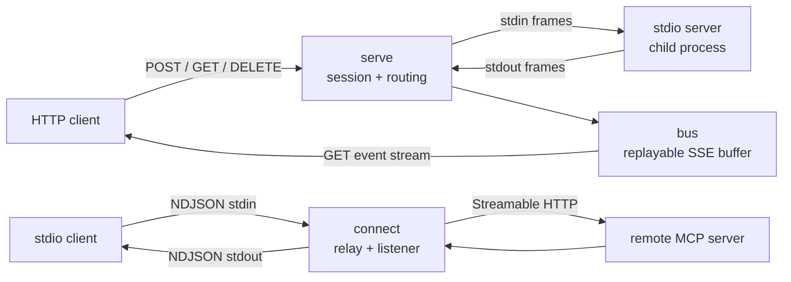

# portway

[English](README.md) | [中文](README.zh.md) | [日本語](README.ja.md)

[](LICENSE) [](go.mod) [](CHANGELOG.md)  [](CONTRIBUTING.md)

**portway：an open-source single-binary bridge that exposes a stdio MCP server over Streamable HTTP — and the reverse. A pure transport adapter: same JSON-RPC messages, different wire; no gateway, no policy, no auth.**


```bash
git clone https://github.com/JaydenCJ/portway.git && cd portway && go install ./cmd/portway
```

> Pre-release: v0.1.0 is not yet published to a module proxy tag; install from source as above. One static Go binary, zero runtime dependencies, binds 127.0.0.1 by default, no telemetry.

## Why portway?

MCP has two standard transports and every integration seems to need the one the other side doesn't speak. Your server is a stdio process, but the client is a web app that can only POST. Your client only knows how to spawn stdio commands, but the server you need lives behind an HTTP URL. The existing bridges each pull in a runtime (Python, Node) plus a dependency tree, cover one direction, or grow into gateways with auth layers and config files — heavy machinery when all you want is the same bytes on a different wire. portway is deliberately smaller: one static binary, two subcommands, both directions, zero configuration. It implements the fiddly parts of the Streamable HTTP spec that ad-hoc bridges skip — `Mcp-Session-Id` lifecycle, `202` semantics, the standalone GET event stream, `Last-Event-ID` resume with a replay buffer, JSON *and* SSE response bodies, protocol-version headers — and refuses to be anything more than a transport adapter. It never rewrites a message, never adds auth, never makes a policy decision; put a real proxy in front if you need one.

| | portway | mcp-proxy (Python) | supergateway (Node) | rewriting on an SDK |
| --- | --- | --- | --- | --- |
| Runtime footprint | one static Go binary | Python + pip deps | Node.js + npm deps | your build |
| Direction | stdio→HTTP **and** HTTP→stdio | both, per mode | stdio→SSE/WS focus | one, hand-built |
| Session lifecycle (`Mcp-Session-Id`, DELETE) | full, spec status codes | partial | partial | up to you |
| Stream resume (`Last-Event-ID` + replay buffer) | yes, duplicate-safe | no | no | up to you |
| Failure honesty on stdio | HTTP errors become JSON-RPC error responses | client hangs or stderr | client hangs or stderr | up to you |
| Scope | transport only, by design | transport | transport + hosting modes | n/a |

<sub>Comparison reflects upstream documentation as of 2026-07. Gateways (auth, RBAC, rate limits, audit) solve a different, complementary problem — portway is only the wire and will stay that way.</sub>

## Features

- **Both directions, one binary** — `portway serve` puts any stdio MCP server on an HTTP endpoint; `portway connect` presents any Streamable HTTP endpoint as a plain stdio server for clients that can only spawn commands.
- **The full session contract** — `Mcp-Session-Id` assigned at initialize and validated afterwards, `404` for stale sessions, `DELETE` teardown, and child respawn on re-initialize so a restarted client is never locked out.
- **Server-initiated messages survive the crossing** — notifications and server→client requests ride a resumable GET event stream with monotonic SSE ids and a bounded `Last-Event-ID` replay buffer; delivery after a racy reconnect is duplicate-free by construction.
- **No deadlocks, no hangs** — requests relay concurrently (a slow tool call can't block a sampling round trip), and every HTTP-level failure of a request is synthesized into a JSON-RPC error response instead of leaving a stdio client waiting forever.
- **Framing done right** — NDJSON with CRLF tolerance and a 32 MiB frame cap, a spec-grammar SSE reader/writer, JSON compaction whenever a message crosses onto a newline-delimited wire, numeric vs string ids kept distinct, batches refused per protocol 2025-06-18.
- **Zero dependencies, zero telemetry** — pure Go stdlib; portway talks only to the process or URL you give it, binds 127.0.0.1 by default, and is verified by 92 offline tests plus an end-to-end smoke script.

## Quickstart

Expose the bundled demo stdio server over HTTP:

```bash
cd examples
portway serve -- ./demo-server.sh
```

```text
portway 0.1.0: serving "./demo-server.sh" at http://127.0.0.1:8137/mcp
```

Talk to it with anything that speaks HTTP — real captured output:

```bash
curl -si -X POST http://127.0.0.1:8137/mcp \
  -H 'Content-Type: application/json' \
  -H 'Accept: application/json, text/event-stream' \
  -d '{"jsonrpc":"2.0","id":1,"method":"initialize","params":{"protocolVersion":"2025-06-18","capabilities":{},"clientInfo":{"name":"curl","version":"0"}}}'
```

```text
HTTP/1.1 200 OK
Content-Type: application/json
Mcp-Session-Id: 96a471be8fa819195d80731d7bfbd389

{"jsonrpc":"2.0","id":1,"result":{"protocolVersion":"2025-06-18","capabilities":{"tools":{},"logging":{}},"serverInfo":{"name":"demo-server","version":"0.3.0"}}}
```

The reverse direction bridges it straight back to stdio — note the server-initiated notification arriving from the GET event stream between the responses (relay is concurrent, so the exact interleaving varies run to run):

```bash
portway connect http://127.0.0.1:8137/mcp < requests.ndjson
```

```text
{"jsonrpc":"2.0","id":1,"result":{"protocolVersion":"2025-06-18","capabilities":{"tools":{},"logging":{}},"serverInfo":{"name":"demo-server","version":"0.3.0"}}}
{"jsonrpc":"2.0","id":2,"result":{"tools":[{"name":"echo","description":"Echo text back","inputSchema":{"type":"object","properties":{"text":{"type":"string"}}}}]}}
{"jsonrpc":"2.0","method":"notifications/message","params":{"level":"info","data":"echo tool was called"}}
{"jsonrpc":"2.0","id":3,"result":{"content":[{"type":"text","text":"hello from stdio"}]}}
{"jsonrpc":"2.0","id":4,"result":{}}
```

To give a stdio-only client a remote HTTP server, point its config at `portway connect`:

```json
{
  "mcpServers": {
    "remote-tools": {
      "command": "portway",
      "args": ["connect", "--header", "Authorization: Bearer YOUR_TOKEN", "https://mcp.example.test/mcp"]
    }
  }
}
```

## Commands and flags

| Flag | Default | Effect |
| --- | --- | --- |
| `serve --listen addr` | `127.0.0.1:8137` | address to bind; use `:0` for a random port (printed on stderr) |
| `serve --path path` | `/mcp` | the single MCP endpoint path |
| `serve --buffer n` | `256` | server-initiated messages retained for `Last-Event-ID` replay |
| `connect --header 'K: V'` | none | extra HTTP header, repeatable (e.g. `Authorization`) |
| `connect --no-listen` | off | skip the GET stream for server-initiated messages |
| `--verbose` | off | one log line per notable event, on stderr |

Exit codes: `2` for usage errors, `1` for runtime failures, `0` otherwise. The exact HTTP↔stdio mapping — status codes, headers, session semantics and the design decisions behind them — is specified in [docs/transport-mapping.md](docs/transport-mapping.md).

## Architecture



Both directions share the same small pure packages — `jsonrpc` (classification, id keys), `ndjson` and `sse` (framing), `bus` (resumable stream buffer) — so every routing rule is unit-tested once and used everywhere.

## Roadmap

- [x] v0.1.0 — both bridge directions: session lifecycle, JSON + SSE POST responses, resumable GET event stream, concurrent relay, failure synthesis, 92 tests + smoke script
- [ ] Per-request SSE responses in serve mode with `progressToken` affinity
- [ ] Optional TLS for `serve` (`--cert`/`--key`) for non-loopback deployments
- [ ] `--redact-log` to mask tool arguments in `--verbose` output
- [ ] Windows support: signal handling parity for the child process
- [ ] Integration-test matrix against popular MCP SDK servers

See the [open issues](https://github.com/JaydenCJ/portway/issues) for the full list.

## Contributing

Bug reports with a `--verbose` log or a curl transcript, spec-conformance findings, and pull requests are all welcome — see [CONTRIBUTING.md](CONTRIBUTING.md) for the local workflow (`go test ./...` plus `scripts/smoke.sh` printing `SMOKE OK`). Good entry points are labelled [good first issue](https://github.com/JaydenCJ/portway/issues?q=is%3Aissue+is%3Aopen+label%3A%22good+first+issue%22), and design questions live in [Discussions](https://github.com/JaydenCJ/portway/discussions).

## License

[MIT](LICENSE)
