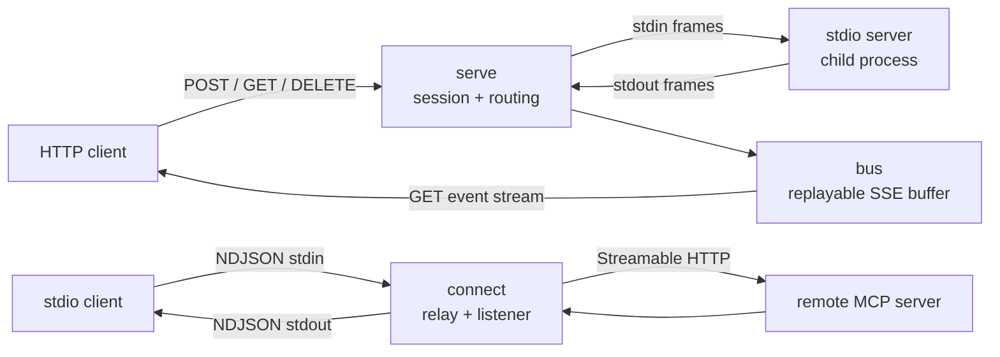

# portway

[English](README.md) | [中文](README.zh.md) | [日本語](README.ja.md)

[](LICENSE) [](go.mod) [](CHANGELOG.md)  [](CONTRIBUTING.md)

**portway：开源单二进制桥接器，把 stdio MCP 服务器暴露为 Streamable HTTP——也支持反向。纯传输适配器：同样的 JSON-RPC 消息，不同的线路；不是网关，没有策略，没有鉴权。**


```bash
git clone https://github.com/JaydenCJ/portway.git && cd portway && go install ./cmd/portway
```

> 预发布：v0.1.0 尚未发布到 module proxy tag，请按上述方式从源码安装。一个静态 Go 二进制，零运行时依赖，默认绑定 127.0.0.1，无遥测。

## 为什么选 portway？

MCP 有两种标准传输，而每次集成似乎都需要对方不会说的那一种。你的服务器是 stdio 进程，客户端却是只能发 POST 的 Web 应用；你的客户端只会拉起 stdio 命令，需要的服务器却躲在一个 HTTP URL 后面。现有的桥接方案要么拖上一个运行时（Python、Node）加一棵依赖树，要么只覆盖一个方向，要么逐渐膨胀成带鉴权层和配置文件的网关——而你想要的只是同样的字节换一条线路。portway 刻意做得更小：一个静态二进制、两个子命令、双向覆盖、零配置。它实现了临时桥接总会跳过的 Streamable HTTP 规范细节——`Mcp-Session-Id` 生命周期、`202` 语义、独立的 GET 事件流、带重放缓冲的 `Last-Event-ID` 续传、JSON *与* SSE 两种响应体、协议版本头——并且拒绝成为传输适配器之外的任何东西。它绝不改写消息、绝不附加鉴权、绝不做策略决定；需要的话请在前面放一个真正的代理。

| | portway | mcp-proxy (Python) | supergateway (Node) | 基于 SDK 自己重写 |
| --- | --- | --- | --- | --- |
| 运行时体积 | 一个静态 Go 二进制 | Python + pip 依赖 | Node.js + npm 依赖 | 取决于你的构建 |
| 方向 | stdio→HTTP **且** HTTP→stdio | 双向，按模式 | 侧重 stdio→SSE/WS | 单向，手工搭建 |
| 会话生命周期（`Mcp-Session-Id`、DELETE） | 完整，规范状态码 | 部分 | 部分 | 自己实现 |
| 流续传（`Last-Event-ID` + 重放缓冲） | 支持，防重复 | 无 | 无 | 自己实现 |
| stdio 侧的失败诚实性 | HTTP 错误变成 JSON-RPC 错误响应 | 客户端挂起或仅 stderr | 客户端挂起或仅 stderr | 自己实现 |
| 定位 | 有意只做传输 | 传输 | 传输 + 托管模式 | 不适用 |

<sub>对比基于 2026-07 时各上游文档。网关（鉴权、RBAC、限流、审计）解决的是另一个互补问题——portway 只做线路本身，并会一直如此。</sub>

## 特性

- **双向，一个二进制** — `portway serve` 把任意 stdio MCP 服务器放到一个 HTTP 端点上；`portway connect` 把任意 Streamable HTTP 端点呈现为普通 stdio 服务器，供只会拉起命令的客户端使用。
- **完整的会话契约** — `Mcp-Session-Id` 在 initialize 时分配、之后严格校验，过期会话返回 `404`，`DELETE` 拆除会话，重新 initialize 时重启子进程，重启后的客户端永远不会被锁在门外。
- **服务器主动消息安全过桥** — 通知和服务器→客户端请求经由可续传的 GET 事件流传递，SSE id 单调递增，`Last-Event-ID` 重放缓冲有界；即使重连竞态也从结构上杜绝重复投递。
- **不死锁、不挂起** — 请求并发转发（慢工具调用不会堵死 sampling 往返），请求在 HTTP 层的任何失败都会合成为 JSON-RPC 错误响应，绝不让 stdio 客户端永远等待。
- **帧处理做对** — NDJSON 容忍 CRLF 并有 32 MiB 帧上限，SSE 读写严格遵循规范文法，消息跨到换行分隔线路时自动压平 JSON，数字 id 与字符串 id 严格区分，按 2025-06-18 协议拒绝批量消息。
- **零依赖、零遥测** — 纯 Go 标准库；portway 只与你指定的进程或 URL 通信，默认绑定 127.0.0.1，由 92 个离线测试加端到端冒烟脚本验证。

## 快速上手

把内置的演示 stdio 服务器暴露为 HTTP：

```bash
cd examples
portway serve -- ./demo-server.sh
```

```text
portway 0.1.0: serving "./demo-server.sh" at http://127.0.0.1:8137/mcp
```

任何会说 HTTP 的东西都能与它对话——以下为真实捕获的输出：

```bash
curl -si -X POST http://127.0.0.1:8137/mcp \
  -H 'Content-Type: application/json' \
  -H 'Accept: application/json, text/event-stream' \
  -d '{"jsonrpc":"2.0","id":1,"method":"initialize","params":{"protocolVersion":"2025-06-18","capabilities":{},"clientInfo":{"name":"curl","version":"0"}}}'
```

```text
HTTP/1.1 200 OK
Content-Type: application/json
Mcp-Session-Id: 96a471be8fa819195d80731d7bfbd389

{"jsonrpc":"2.0","id":1,"result":{"protocolVersion":"2025-06-18","capabilities":{"tools":{},"logging":{}},"serverInfo":{"name":"demo-server","version":"0.3.0"}}}
```

反方向可以把它直接桥回 stdio——注意响应之间那条来自 GET 事件流的服务器主动通知（转发是并发的，所以具体交错顺序每次运行会有所不同）：

```bash
portway connect http://127.0.0.1:8137/mcp < requests.ndjson
```

```text
{"jsonrpc":"2.0","id":1,"result":{"protocolVersion":"2025-06-18","capabilities":{"tools":{},"logging":{}},"serverInfo":{"name":"demo-server","version":"0.3.0"}}}
{"jsonrpc":"2.0","id":2,"result":{"tools":[{"name":"echo","description":"Echo text back","inputSchema":{"type":"object","properties":{"text":{"type":"string"}}}}]}}
{"jsonrpc":"2.0","method":"notifications/message","params":{"level":"info","data":"echo tool was called"}}
{"jsonrpc":"2.0","id":3,"result":{"content":[{"type":"text","text":"hello from stdio"}]}}
{"jsonrpc":"2.0","id":4,"result":{}}
```

想让只支持 stdio 的客户端使用远程 HTTP 服务器，把它的配置指向 `portway connect` 即可：

```json
{
  "mcpServers": {
    "remote-tools": {
      "command": "portway",
      "args": ["connect", "--header", "Authorization: Bearer YOUR_TOKEN", "https://mcp.example.test/mcp"]
    }
  }
}
```

## 命令与参数

| 参数 | 默认值 | 作用 |
| --- | --- | --- |
| `serve --listen addr` | `127.0.0.1:8137` | 绑定地址；`:0` 表示随机端口（打印到 stderr） |
| `serve --path path` | `/mcp` | 唯一的 MCP 端点路径 |
| `serve --buffer n` | `256` | 为 `Last-Event-ID` 重放保留的服务器主动消息数量 |
| `connect --header 'K: V'` | 无 | 额外 HTTP 头，可重复（例如 `Authorization`） |
| `connect --no-listen` | 关 | 不打开承载服务器主动消息的 GET 流 |
| `--verbose` | 关 | 每个关键事件在 stderr 打印一行日志 |

退出码：用法错误为 `2`，运行时失败为 `1`，其余为 `0`。HTTP↔stdio 的精确映射——状态码、头、会话语义及其背后的设计取舍——详见 [docs/transport-mapping.md](docs/transport-mapping.md)。

## 架构



两个方向共用同一组小而纯的包——`jsonrpc`（分类、id 键）、`ndjson` 与 `sse`（帧处理）、`bus`（可续传流缓冲）——每条路由规则只需单元测试一次，处处复用。

## 路线图

- [x] v0.1.0 — 双向桥接：会话生命周期、JSON + SSE POST 响应、可续传 GET 事件流、并发转发、失败合成、92 个测试 + 冒烟脚本
- [ ] serve 模式按请求返回 SSE 响应，并支持 `progressToken` 关联
- [ ] `serve` 的可选 TLS（`--cert`/`--key`），用于非回环部署
- [ ] `--redact-log`：在 `--verbose` 输出中掩盖工具参数
- [ ] Windows 支持：子进程信号处理对齐
- [ ] 针对主流 MCP SDK 服务器的集成测试矩阵

完整列表见 [open issues](https://github.com/JaydenCJ/portway/issues)。

## 参与贡献

欢迎附带 `--verbose` 日志或 curl 记录的 bug 报告、规范符合性问题以及 pull request——本地流程见 [CONTRIBUTING.md](CONTRIBUTING.md)（`go test ./...` 加上打印 `SMOKE OK` 的 `scripts/smoke.sh`）。入门任务标注为 [good first issue](https://github.com/JaydenCJ/portway/issues?q=is%3Aissue+is%3Aopen+label%3A%22good+first+issue%22)，设计讨论在 [Discussions](https://github.com/JaydenCJ/portway/discussions)。

## 许可证

[MIT](LICENSE)
